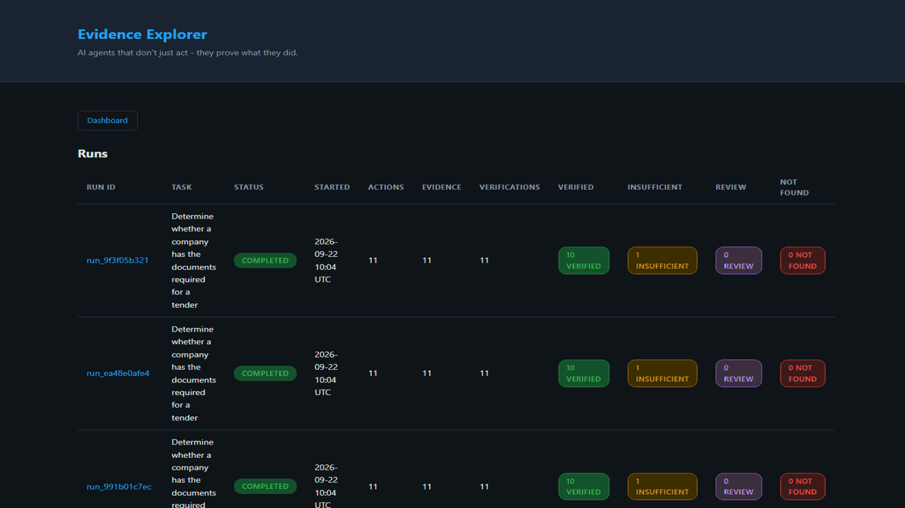

# Evidence-First Agent

**AI agents that don't just act — they prove what they did.**

---

## Why Evidence-First?

Traditional agent: "Done."

Evidence-first agent: "Done. Here is what I did, why I did it, what evidence supports it, and how the result was verified."

---

## Problem

Traditional AI agents can say "Done." But business workflows require answers to harder questions:

- What exactly did the agent do?
- Why did it do it?
- What evidence supports the result?
- Did the action actually succeed?
- Can a human audit the full execution?

Evidence-first agents solve this by making **every meaningful action traceable, verifiable, and auditable**.

---

## Solution

Evidence-First Agent is a reusable open-source infrastructure for building business workflow agents where:

1. Every action creates a structured **Action** record
2. Every action produces an **Observation**
3. Every observation generates **Evidence** with metadata for reproduction
4. Every result undergoes **Verification** — success ≠ correct
5. All entities are linked in an **Evidence Graph**
6. High-risk actions require **Human Approval**
7. The full execution is stored as a **Run** with complete history

---

## Screenshots

### Evidence Explorer


### Deterministic Verification


### Verified Evidence


## Demo

A 60-second portfolio demo recording showing the Evidence Explorer UI in action:



[Watch MP4](docs/demo/evidence-first-agent-demo.mp4)

The demo covers:
1. Dashboard overview with verification counts
2. Insurance requirement — deterministic failure (expiry before tender deadline)
3. VERIFIED requirement — supporting evidence with confidence score
4. Evidence chain showing the full reasoning path
5. Conclusion and return to dashboard

---

## Architecture


The evidence flow follows a strict chain:

```text
Task -> Action -> Observation -> Evidence -> Verification -> Conclusion
```

### Components

| Module | Purpose |
|--------|---------|
| `evidence_first/agent/` | Planner, Executor, Verifier |
| `evidence_first/tools/` | Tool interface + implementations |
| `evidence_first/evidence/` | Storage, graph, recorder |
| `evidence_first/web.py` | Web UI and API |
| `evidence_first/llm/` | LLM provider abstraction |
| `evidence_first/runtime/` | Permissions, approvals, run loop |
| `evidence_first/cli/` | Command-line interface |
| `evidence_first/models/` | Data models (in `models.py`)

---

## Features

- **Evidence Recording** — Every action, observation, and evidence item is persisted
- **Evidence Graph** — Lightweight graph linking requirements → actions → observations → evidence → verification → conclusion
- **Verification** — Actions succeeding ≠ business tasks succeeding; verifier checks actual outcomes
- **Permission System** — READ, ANALYZE, CREATE, MODIFY, SEND, SUBMIT, DELETE
- **Human Approval** — High-risk actions pause for explicit approval
- **SQLite Storage** — Simple local storage, replaceable with any other backend
- **Model Independence** — LLM provider is abstracted; mock provider works without API keys
- **Tool Abstraction** — Tools are pluggable; filesystem, search, HTTP, browser, MCP can be added
- **Deterministic Testing** — Mock LLM enables full test suite without external APIs

---

## Quick Start

### Prerequisites

- Python 3.11+
- No external API keys required (mock provider included)

### Install

```bash
pip install -e .
```

### Run a task

```python
python -m evidence_first.cli.main run examples/tender/task.yaml
```

### Inspect evidence from a run

```bash
evidence-agent inspect <run-id>
```

### Run with auto-approval (for testing)

```bash
evidence-agent run --auto-approve examples/tender/task.yaml
```

---

## Example

The included tender example demonstrates the system checking whether a company has documents required for a tender submission.

```bash
evidence-agent run --auto-approve examples/tender/task.yaml
```

Output:

```
Run ID: run_abc123
Task: Determine whether a company has the documents required for a tender
Status: completed

Progress:
  DONE Step 1: read_file via filesystem - completed
  DONE Step 2: search_documents via document_search - completed
  ...
  DONE Step 11: search_documents via document_search - completed
Run completed with 11 steps.
```

Or using the module directly:

```bash
python -m evidence_first.cli.main run examples/tender/task.yaml
```

```bash
evidence-agent inspect run_abc123
```

This displays:
- All actions taken
- Evidence items with file references and hashes
- Verification results with confidence scores
- Evidence graph edges showing relationships

---

## Web UI

Start the Evidence Explorer web UI:

```bash
python -m evidence_first.web
```

Then open http://127.0.0.1:8000 in your browser.

### Screens

- **Dashboard** (`/`) - List all runs with verification counts
- **Run Detail** (`/runs/{run_id}`) - Run summary, verification breakdown, requirement cards
- **Requirement Detail** (`/runs/{run_id}/requirements/{action_id}`) - Evidence chain with reasoning and excerpts
- **Approval Queue** (`/runs/{run_id}/approvals`) - Pending approvals (if any)

### API Endpoints

- `GET /api/runs` - List all runs
- `GET /api/runs/{run_id}` - Run detail with actions, evidence, verifications
- `GET /api/runs/{run_id}/requirements` - Requirements with verification status
- `GET /api/runs/{run_id}/evidence` - Evidence records
- `GET /api/runs/{run_id}/approvals` - Approval records

### Evidence Chain

The UI visualizes the evidence chain:

```text
Requirement -> Search -> Document -> Evidence -> Verification -> Conclusion
```

### Example

For the tender example, the UI shows 10 VERIFIED and 1 EVIDENCE_FOUND_BUT_INSUFFICIENT (insurance expired before tender deadline).

---

## CLI Usage

### `evidence-agent run`

Execute a task from a YAML file.

```bash
evidence-agent run [OPTIONS] TASK_FILE
```

Options:
- `--auto-approve` — Auto-approve all permission requests (use for testing)

### `evidence-agent inspect`

Inspect evidence from a completed run.

```bash
evidence-agent inspect RUN_ID
```

Displays actions, evidence, verifications, and graph edges.

---

## Evidence Model

Every entity in the system has structured metadata:

### Action

```json
{
  "action_id": "act_001",
  "type": "read_file",
  "tool": "filesystem",
  "input": {"path": "doc.pdf"},
  "reason": "Need to verify certification",
  "timestamp": "...",
  "status": "success",
  "permission_required": "READ"
}
```

### Observation

```json
{
  "observation_id": "obs_001",
  "action_id": "act_001",
  "content": "File contents...",
  "timestamp": "...",
  "metadata": {"success": true}
}
```

### Evidence

```json
{
  "evidence_id": "ev_001",
  "observation_id": "obs_001",
  "action_id": "act_001",
  "content": "extracted text",
  "source_type": "document",
  "filename": "cert.pdf",
  "page": 4,
  "snippet": "relevant excerpt",
  "hash": "sha256:abc123",
  "timestamp": "..."
}
```

### Verification

```json
{
  "verification_id": "ver_001",
  "action_id": "act_001",
  "observation_id": "obs_001",
  "verified": true,
  "confidence": 0.9,
  "reason": "Certificate expiry is after tender deadline",
  "evidence_ids": ["ev_001"]
}
```

---

## Permission Model

Actions are classified by risk and require corresponding permissions:

| Permission | Risk | Examples |
|------------|------|----------|
| READ | LOW | Read documents, search files |
| ANALYZE | LOW | Analyze text, extract data |
| CREATE | LOW | Create drafts, write local files |
| MODIFY | MEDIUM | Modify records |
| SEND | HIGH | Send emails, make API calls |
| SUBMIT | HIGH | Submit tenders, publish content |
| DELETE | HIGH | Delete data |

**Approval gates** are triggered for `SEND`, `SUBMIT`, and `DELETE` actions.

---

## Verification

Verification checks whether an action's success means the business task succeeded.

For example, a browser click succeeding ≠ a tender being submitted.

The verifier returns:

```json
{
  "verified": true,
  "confidence": 0.9,
  "reason": "Certificate is valid for tender period",
  "evidence_ids": ["ev_001"]
}
```

Different tools can provide different verification strategies.

---

## Testing

The test suite is fully runnable without external APIs:

```bash
pytest tests/ -v
```

All 112 tests cover:

- Action recording
- Evidence recording
- Evidence relationships
- Graph traversal
- Verification logic
- Permissions and approval flow
- Failed actions
- Incomplete evidence
- Deterministic/mock agent execution
- Run persistence
- CLI interface
- Real file handling
- Path security restrictions

---

## Security

- **Explicit permissions** — No unrestricted autonomy
- **Approval gates** — Consequential actions require human approval
- **Path restrictions** — Filesystem tools restricted to working directory
- **No shell access** — No unrestricted shell by default
- **No secret logging** — Avoid storing unnecessary sensitive content
- **Facts vs conclusions** — Clear distinction between observed facts and agent-generated conclusions

---

## Limitations

1. **SQLite storage** — Single-process; not suitable for concurrent multi-process access without additional coordination
2. **No browser** — Browser/desktop tools not included in MVP
3. **No MCP** — Model Context Protocol not integrated in MVP
4. **Mock LLM** — Default planning is deterministic; real LLM integration requires provider setup
5. **No encryption** — Evidence stored in plaintext SQLite
6. **Single-user** — No multi-user or authentication system
7. **No remote storage** — All data stored locally

---

## Roadmap

| Phase | Focus |
|-------|-------|
| **Phase 1** | Core evidence runtime |
| **Phase 2** | Document-aware agents (PDF parsing, OCR) |
| **Phase 3** | Browser tool adapter |
| **Phase 4** | MCP tool integration |
| **Phase 5** | Desktop/computer-use adapter |
| **Phase 6** | Evidence visualization UI |
| **Phase 7** | More sophisticated verification strategies |
| **Phase 8** | Sandboxed execution environment |
| **Phase 9** | Business workflow templates |
| **Phase 10** | Multi-agent workflows |

Browser, desktop, and computer-use components are treated as **execution adapters**. The project's core identity remains: **EVIDENCE + VERIFICATION + AUDITABILITY + PERMISSIONS**.

---

## Contribution Guide

1. Fork the repository
2. Create a feature branch
3. Write tests for new functionality (all tests must pass without external APIs)
4. Follow the modular architecture — new tools, verifiers, and providers should be additive
5. Submit a pull request

### Adding a new tool

1. Create a class inheriting from `evidence_first.tools.base.Tool`
2. Implement `name`, `description`, `input_schema`, `execute()`
3. Optionally implement `can_verify()` and `verify()`
4. Register the tool in the runtime

### Adding a new LLM provider

1. Create a class inheriting from `evidence_first.llm.base.LLMProvider`
2. Implement `name`, `generate()`, `generate_json()`
3. No changes needed to runtime, planner, or executor

### Adding a new verifier

1. Implement a function matching `verifier(action, observation) -> dict`
2. Register via `Verifier.register_verifier(tool_name, fn)`
3. Or implement `Tool.verify()` on the tool itself

---

## License

MIT
