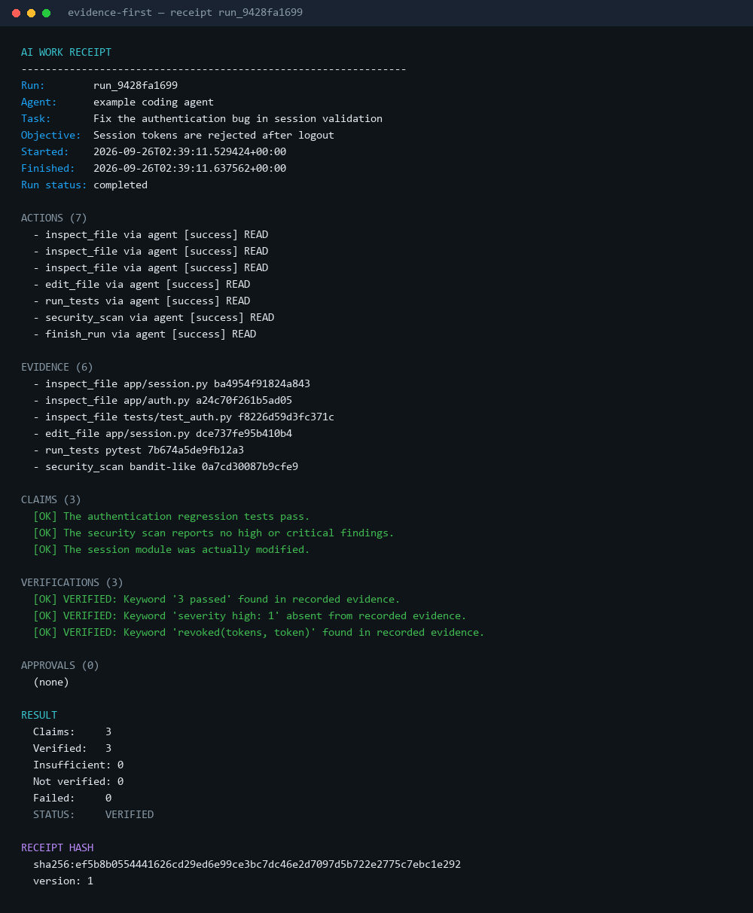
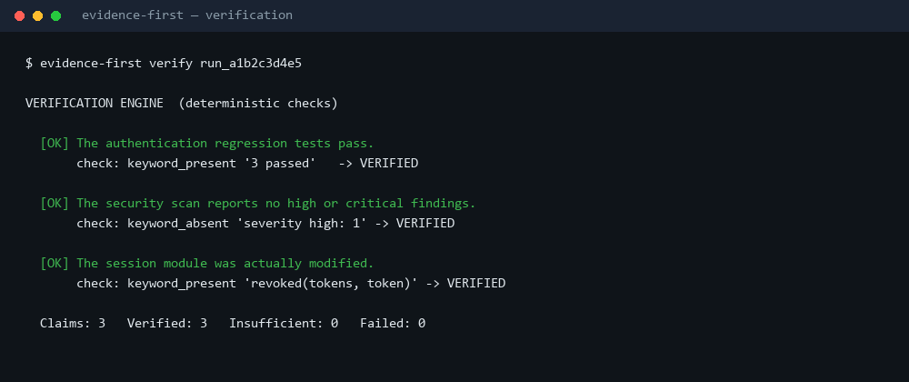
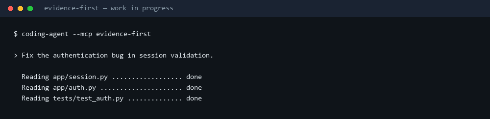
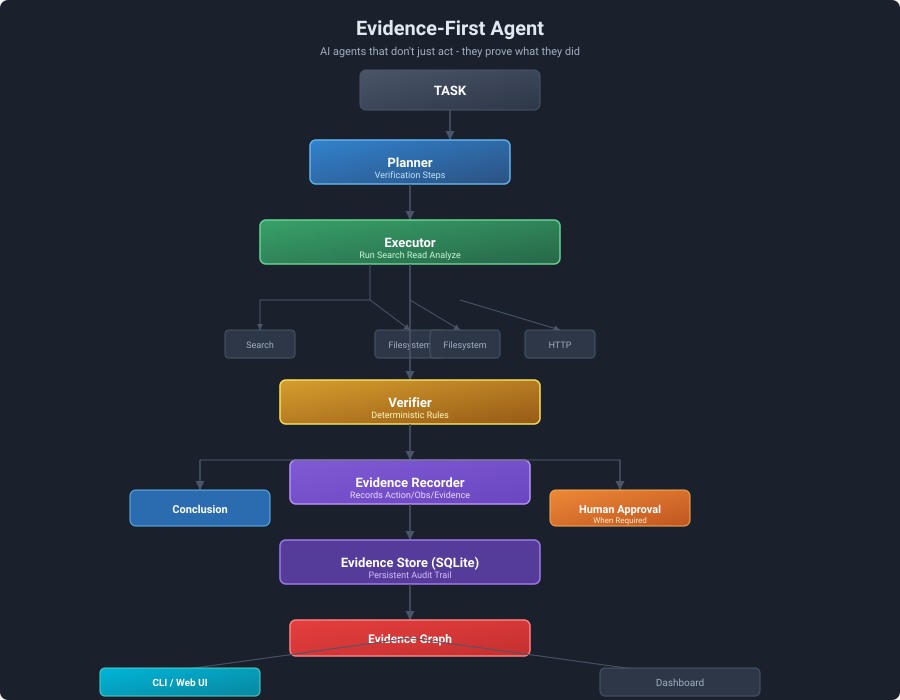
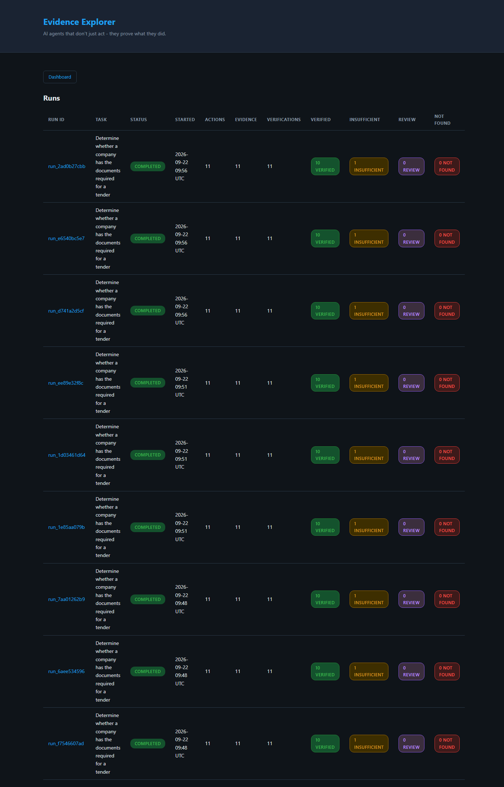
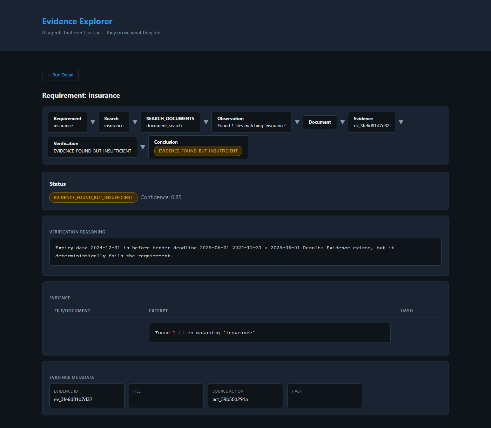
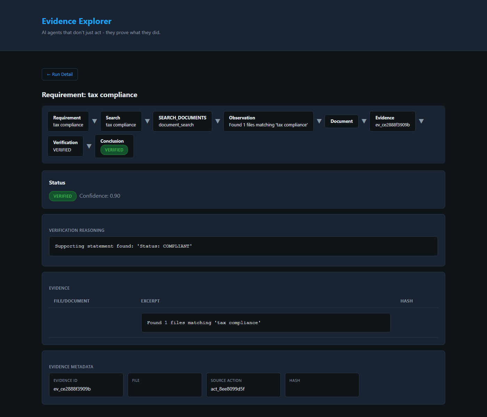

# Evidence-First Agent

### AI agents that don't just say they're done — they prove what they did.

```text
AI Agent
   ↓
Actions
   ↓
Evidence
   ↓
Claims
   ↓
Verification
   ↓
Approvals (where required)
   ↓
AI Work Receipt   ← versioned JSON + SHA-256
```

An **AI Work Receipt** is a portable, hashable summary of one unit of agent
work: what was done, what evidence was produced, which claims were made, how
each claim was verified, which approvals were needed, and the resulting status —
`VERIFIED`, `FAILED`, or `NEEDS_REVIEW`.

Agent frameworks help agents act. Agent orchestration helps agents coordinate.
**Evidence-First Agent helps agents prove their work.**

---

## Demo

```text
$ evidence-first receipt run_8d91a2

AI WORK RECEIPT
────────────────────────────────────────────────────────

Run:        run_8d91a2
Agent:      example coding agent
Task:       Fix the authentication bug in session validation
Objective:  Session tokens are rejected after logout
Started:    2026-09-26T02:43:00.876190+00:00
Finished:   2026-09-26T02:43:00.973702+00:00

ACTIONS (7)
  - inspect_file  via agent [success] READ
  - inspect_file  via agent [success] READ
  - inspect_file  via agent [success] READ
  - edit_file     via agent [success] READ
  - run_tests     via agent [success] READ
  - security_scan via agent [success] READ
  - finish_run    via agent [success] READ

EVIDENCE (6)
  - inspect_file  app/session.py    ba4954f91824a843
  - inspect_file  app/auth.py       a24c70f261b5ad05
  - inspect_file  tests/test_auth.py f8226d59d3fc371c
  - edit_file     app/session.py    dce737fe95b410b4
  - run_tests     pytest            7b674a5de9fb12a3
  - security_scan bandit-like       0a7cd30087b9cfe9

CLAIMS (3)
  [OK] The authentication regression tests pass.
  [OK] The security scan reports no high or critical findings.
  [OK] The session module was actually modified.

VERIFICATIONS (3)
  [OK] VERIFIED: Keyword '3 passed' found in recorded evidence.
  [OK] VERIFIED: Keyword 'severity high: 1' absent from recorded evidence.
  [OK] VERIFIED: Keyword 'revoked(tokens, token)' found in recorded evidence.

APPROVALS (0)
  (none)

RESULT
  Claims: 3   Verified: 3   Insufficient: 0   Failed: 0
  STATUS: VERIFIED

RECEIPT HASH
  sha256:7e2693104671fccd9b9894ff2d9c5d7e4494e50cb62ee8190103ccfff6c1d523
  version: 1
```

> Real output from `python examples/coding_agent/auth_fix.py`, with the run id
> and timestamps from one sample run. Every run produces a different hash.





36-second demo, generated from real output:



---

## Why

A traditional agent answers "Done." That is not enough when someone else has
to rely on the result:

- What exactly did the agent do?
- What evidence supports the claim?
- Did the action actually achieve the goal, or did it merely run?
- Can a human audit the whole execution afterwards?

Evidence-First Agent makes every meaningful step **recorded, checkable, and
hashable** — and it refuses to call work verified when the evidence does not
support it.

---

## Install

```bash
git clone <your-fork-url> evidence-first-agent
cd evidence-first-agent

python -m venv .venv
# macOS/Linux:  source .venv/bin/activate
# Windows:      .venv\Scripts\activate

pip install -e .
```

Requires Python 3.11+. No API keys and no external services are required: the
mock LLM provider and the deterministic verification engine run entirely
locally.

Two console entry points are installed:

| Command | Purpose |
|---------|---------|
| `evidence-first` | receipt-first CLI (`receipt`, `inspect`, `mcp`) |
| `evidence-agent` | the original CLI, with `receipt` and `mcp` added alongside the existing `run` and `inspect` |

---

## Quick start

### 1. Produce a receipt from the coding-agent example

```bash
python examples/coding_agent/auth_fix.py
```

Simulated, deterministic, no credentials. It starts a run, records inspected
files, a code change, test output and a security scan, creates three claims,
verifies each one with a deterministic check, finishes the run, and prints the
receipt. Add `--with-approval` to watch a consequential action get gated
(result becomes `NEEDS_REVIEW`).

### 2. Inspect a receipt

```bash
evidence-first receipt <run-id>
evidence-first receipt <run-id> --json
```

`--json` prints the canonical receipt document — the exact bytes that are
hashed.

### 3. Run the original tender example

```bash
evidence-agent run --auto-approve examples/tender/task.yaml
evidence-first receipt <run-id>
python examples/tender/receipt_demo.py
```

The tender evaluation is unchanged and stays truthful:

```text
Claims:       11
Verified:     10
Insufficient: 1        (insurance expired 2024-12-31, tender deadline 2025-06-01)
Overall:      NEEDS_REVIEW
```

A receipt never rounds "insufficient" up to "verified".

---

## The receipt format

Versioned JSON. Canonical serialization, then SHA-256.

```json
{
  "version": "1",
  "run_id": "run_8d91a2",
  "run": {
    "task_id": "task_1a2b3c",
    "agent": "example coding agent",
    "task": "Fix the authentication bug in session validation",
    "objective": "Session tokens are rejected after logout",
    "status": "completed",
    "started_at": "2026-09-26T02:38:44.755748+00:00",
    "finished_at": "2026-09-26T02:38:44.848773+00:00"
  },
  "actions": [{"action_id": "act_...", "type": "run_tests", "tool": "agent", "status": "success", "permission_required": "READ"}],
  "evidence": [{"evidence_id": "ev_...", "type": "log", "source": "pytest", "hash": "7b67...", "snippet": "3 passed in 0.31s"}],
  "claims": [{"claim_id": "claim_...", "statement": "All authentication tests pass.", "status": "VERIFIED", "source": "explicit", "evidence_ids": ["ev_..."]}],
  "verifications": [{"verification_id": "ver_...", "claim_id": "claim_...", "status": "VERIFIED", "reason": "Keyword '3 passed' found in recorded evidence."}],
  "approvals": [],
  "result": {"status": "VERIFIED", "claims_total": 3, "verified": 3, "insufficient_evidence": 0, "not_verified": 0, "failed": 0, "pending_approvals": 0},
  "integrity": {"algorithm": "sha256", "hash": "sha256:7e269310..."}
}
```

### Hashing rules (deterministic by construction)

1. `integrity` is removed before hashing — the hash never hashes itself.
2. JSON is serialized with sorted keys and `(",", ":")` separators, so builder
   field order cannot change the digest.
3. Lists are explicitly ordered by `(timestamp, id)`.
4. The canonical string is encoded as UTF-8 before hashing.
5. Nothing is generated during hashing; timestamps come from the run record.

The same logical receipt therefore always produces the same
`sha256:…` value, and any change to evidence, a claim, or a verification
changes it. `evidence_first.receipt.verify_receipt_hash()` re-checks a receipt.

**What `VERIFIED` does and does not mean.** It means the recorded evidence
satisfies the check declared for that claim, and that nothing is left pending.
It is not a proof that the underlying work was correct — the checks are
mechanical, the evidence is what the agent recorded, and a claim with no
mechanical check stays `NOT_VERIFIED`.

---

## Claims and verification

A **claim** is a statement that can be checked: "All authentication tests
pass.", "The required file exists.", "The tender requirement is satisfied."

Verification is **deterministic by default**. A claim can carry a check:

| Check | Answers |
|-------|---------|
| `keyword_present` | does the recorded output contain this string? |
| `keyword_absent` | is this string absent (e.g. no high findings)? |
| `file_exists` | does the file exist inside the working directory? |
| `sha256_match` | does the file hash match the recorded value? |
| `evidence_count` | is at least N evidence items recorded? |
| `verification_status_equals` | did the existing engine reach a given status? |

```python
claim = ledger.create_claim(
    run_id,
    "All authentication tests pass.",
    check={"type": "keyword_present", "keyword": "3 passed"},
    evidence_ids=[test_evidence_id],
)
ledger.verify_claim(claim["claim_id"])   # -> VERIFIED
```

Claim states: `VERIFIED`, `FAILED`, `INSUFFICIENT_EVIDENCE`, `NOT_VERIFIED`.

Two rules keep the system honest:

- **Verification is explicit, never automatic.** A claim stays `NOT_VERIFIED`
  until you call `verify_claim` (or the MCP `verify` tool), even when it
  carries a check and the check would pass. `finish_run` does not verify on
  your behalf, so an unverified claim keeps the run at `NEEDS_REVIEW` instead
  of quietly reporting success.
- **A claim without a check is never auto-verified.** It stays `NOT_VERIFIED`
  with a reason. Register your own check with
  `evidence_first.verification.register_check(name, fn)` if you need one.
- **Pre-existing verification states are preserved.** The tender engine's
  `VERIFIED` / `EVIDENCE_FOUND_BUT_INSUFFICIENT` / `EVIDENCE_NOT_FOUND` /
  `NEEDS_HUMAN_REVIEW` are mapped onto the canonical states, and the original
  state is kept in the receipt as `engine_status`.

A claim verification is stored against the claim rather than an action, so it
appears in receipts and in `audit://run/{run_id}`. The Evidence Explorer keeps
rendering action-level verifications, which is why the tender screens look the
same as before.

---

## MCP integration

MCP is the **distribution mechanism**, not the product. The MCP tools are thin
adapters over the same core the CLI and web UI use; no verification logic is
duplicated there.

```text
AI agent
   ↓
MCP server (adapter)
   ↓
Evidence-First core (runs, actions, evidence, claims, verifications, approvals)
   ↓
AI Work Receipt (JSON + SHA-256)
```

### Run the server

```bash
# stdio (primary local path)
python -m evidence_first.mcp.server
evidence-first mcp

# streamable HTTP (local, no auth — see Security)
evidence-first mcp --transport streamable-http --host 127.0.0.1 --port 8765
```

### Tools

| Tool | Purpose |
|------|---------|
| `work_start(task, agent, objective?)` | open a verifiable run → `run_id` |
| `evidence_record(run_id, type, description, source?, content?)` | record an action + observation + evidence |
| `claim_create(run_id, statement, check?, evidence_ids?)` | register a verifiable claim |
| `verify(claim_id)` | run the engine → status, reason, evidence used |
| `approval_request(run_id, action, reason, permission?)` | route consequential work through the approval gate |
| `work_finish(run_id)` | finish the run → status, result, receipt hash |
| `receipt_get(run_id)` | return the complete receipt |

### Resources and prompt

```text
receipt://run/{run_id}     the complete hashable receipt
evidence://run/{run_id}    evidence records with hashes and snippets
audit://run/{run_id}       chronological audit trail
```

Prompt: `verify_work` — instructs an agent to work evidence-first and to
report the engine's status rather than upgrading it.

### Host configuration

```json
{
  "mcpServers": {
    "evidence-first": {
      "command": "python",
      "args": ["-m", "evidence_first.mcp.server"],
      "env": { "PYTHONPATH": "/absolute/path/to/evidence-first-agent" }
    }
  }
}
```

Compatibility, stated precisely:

- **Tested here:** the MCP Python SDK v2 in-memory client (`tests/test_mcp.py`),
  a real stdio subprocess handshake
  (`test_server_runs_over_stdio_transport`), and a full session over the
  streamable-HTTP transport on `127.0.0.1`.
- **Not tested here:** any third-party host application. Hosts that support
  local stdio MCP servers are commonly configured with an `mcpServers` block of
  this shape, but no specific host — Claude Desktop, Claude Code, Codex, or
  Cursor — was exercised in this repository. Treat those as *should work*
  until you try it.

---

## Architecture



```text
                    AI AGENT
                       │
                       ▼
                  MCP SERVER                (adapter: tools, resources, prompt)
                       │
                       ▼
              EVIDENCE-FIRST CORE         (WorkLedger: source of truth)
                       │
       ┌───────────────┼────────────────┐
       ▼               ▼                ▼
     Actions        Evidence        Claims
       │               │                │
       └───────────────┼────────────────┘
                       ▼
                  VERIFICATION        (deterministic checks)
                       │
                       ▼
                    APPROVAL          (SEND / SUBMIT / DELETE gate)
                       │
                       ▼
                 WORK RECEIPT
                       │
                       ▼
               canonical JSON + SHA-256
```

### Modules

| Module | Purpose |
|--------|---------|
| `evidence_first/models.py` | Task, Action, Observation, Evidence, **Claim**, Verification, Conclusion, Approval, Run, GraphEdge |
| `evidence_first/evidence/` | SQLite store, recorders, evidence graph |
| `evidence_first/runtime/` | Planner/Executor/Verifier loop, permissions, approvals |
| `evidence_first/verification.py` | canonical claim states + deterministic check registry |
| `evidence_first/work.py` | `WorkLedger`: run lifecycle, claims, verification, approvals, audit trail |
| `evidence_first/receipt.py` | receipt assembly, canonical JSON, SHA-256, rendering |
| `evidence_first/redaction.py` | secret detection and redaction |
| `evidence_first/mcp/` | MCP v2 server (adapter) |
| `evidence_first/cli/` | CLI (`evidence-first`, `evidence-agent`) |
| `evidence_first/web.py` | Evidence Explorer web UI + JSON API |
| `evidence_first/agent/` | planner, executor, verifier, tender verifier strategies |
| `evidence_first/tools/` | tool interface + filesystem and document search |
| `evidence_first/llm/` | LLM provider abstraction (mock provider included) |

---

## CLI

### `evidence-first receipt` / `evidence-agent receipt`

```bash
evidence-first receipt RUN_ID            # human-readable receipt
evidence-first receipt RUN_ID --json     # canonical JSON (the hashed bytes)
evidence-first receipt RUN_ID --db PATH  # alternative database
```

### `evidence-agent run` (unchanged)

```bash
evidence-agent run [OPTIONS] TASK_FILE
  --auto-approve   auto-approve permission requests (testing only)
```

### `evidence-agent inspect` (unchanged)

```bash
evidence-agent inspect RUN_ID
```

Shows actions, observations, evidence, verifications, and graph edges.

### `evidence-first mcp`

```bash
evidence-first mcp [--transport stdio|streamable-http] [--host H] [--port P] [--db PATH]
```

---

## Web UI (unchanged)

```bash
python -m evidence_first.web        # http://127.0.0.1:8000
```

Screens: Dashboard, Run Detail, Requirement Detail (evidence chain), Approval
Queue. API: `/api/runs`, `/api/runs/{id}`, `/api/runs/{id}/requirements`,
`/api/runs/{id}/evidence`, `/api/runs/{id}/approvals`.



The deterministic-failure view (insurance expired before the deadline) and a
VERIFIED requirement with its supporting excerpt:




A walkthrough of the Evidence Explorer is still available (about 65 seconds):
[GIF](docs/demo/evidence-first-agent-demo.gif) ·
[MP4](docs/demo/evidence-first-agent-demo.mp4).

---

## Evidence model

The chain is unchanged from the original framework:

```text
Task → Action → Observation → Evidence → Verification → Conclusion
```

New in this release: **Claims** (statements to be verified) and the
**Work Receipt** (the portable summary of a whole run). Both reuse the
existing tables; the `claims` table is the only schema addition, created
automatically on first use.

---

## Permission model

| Permission | Risk | Approval |
|------------|------|----------|
| READ, ANALYZE, CREATE | LOW | no |
| MODIFY | MEDIUM | no |
| SEND, SUBMIT, DELETE | HIGH | **required** |

Agent-reported action names are resolved conservatively
(`send_email` → `SEND`, `submit_tender` → `SUBMIT`, `delete_records` →
`DELETE`). **Anything unrecognised fails closed**: it is treated as
consequential and gated behind a human. A caller-supplied `permission` can
raise that bar but never lower it, and an unrecognised permission value is
rejected rather than treated as low risk.

---

## Testing

```bash
pip install -e ".[dev]"
pytest tests/ -v
```

237 tests, all runnable offline:

| Suite | Tests | Covers |
|-------|-------|--------|
| `test_core.py` | 75 | models, recorders, graph, verifiers, permissions, approvals, tools, planner, executor, runtime, path security |
| `test_web.py` | 21 | Evidence Explorer pages and JSON API |
| `test_runtime.py` | 11 | end-to-end tender runs, persistence, approval pause/resume |
| `test_cli.py` | 5 | CLI behaviour (existing commands preserved) |
| `test_receipt.py` | 25 | receipt structure, deterministic hashing, tamper detection, redaction, rendering, CLI, tender receipt |
| `test_work.py` | 42 | run lifecycle, claims, deterministic checks, approval gating, audit trail |
| `test_mcp.py` | 31 | MCP startup, tool discovery, lifecycle, verification, approval safety, integrity, resources, prompt, errors, real stdio transport |
| `test_security.py` | 27 | secret redaction, path escape, fail-closed permissions, SQL injection safety |

Regenerate the visuals (screenshots + demo GIF) from real output with:

```bash
pip install pillow        # only needed for this script, not for the package
python scripts/make_visuals.py
```

---

## Security

- **Secret redaction on write** — API keys, bearer tokens, JWTs, private key
  blocks, passwords and credential-shaped environment assignments are replaced
  with `[REDACTED]` before evidence, actions, observations, verifications,
  claims, or approvals are stored, and again when a receipt is built.
- **Receipts carry references, not payloads** — evidence appears as a snippet
  plus a hash, never as a full document body or environment dump.
- **Explicit permissions** — no unrestricted autonomy.
- **Approval gates** — consequential actions require human approval; the MCP
  surface deliberately exposes no way to approve one, and unclassified actions
  fail closed. A declared `permission` can raise a gate but not clear one.
- **Pending approvals outrank passing checks** — a run with a blocked action
  reports `NEEDS_REVIEW` even when every claim verified.
- **Path restrictions** — filesystem tools *and* claim checks
  (`file_exists`, `sha256_match`) are confined to the working directory.
- **No command execution over MCP** — the MCP tools record and verify; they do
  not execute shell commands or write files.
- **Parameterized SQL** — all statements bind parameters.
- **HTTP transport has no authentication.** If you expose
  `--transport streamable-http`, bind it to `127.0.0.1` and treat it as a
  single-user local tool.

---

## Limitations

1. **Local developer tool** — not production-hardened; no auth, no multi-user,
   no remote storage, no encryption at rest.
2. **SQLite** — single-process; concurrent multi-process access needs extra
   coordination.
3. **Verification is deterministic, not semantic** — LLM-based semantic
   verification is not wired in; claims without a mechanical check stay
   `NOT_VERIFIED` by design.
4. **MCP server exposes recording, not execution** — the agent still performs
   the actual work with its own tools; Evidence-First records and checks it.
5. **One DB per project** — the default database is
   `./.evidence_first/evidence.db`.
6. **Receipts reference evidence, they do not embed it** — keep the database
   if you need full evidence bodies.

---

## Roadmap

| Phase | Focus |
|-------|-------|
| **Done** | Evidence runtime, verification engine, web UI, **claims**, **work receipts + SHA-256**, **MCP v2 adapter** |
| Next | Signed receipts, receipt verification CLI for third parties, richer check library |
| Later | Remote storage, multi-user, more tool adapters |

The core identity remains: **EVIDENCE + VERIFICATION + AUDITABILITY +
PERMISSIONS**. MCP is how that reaches AI applications.

---

## Extending

### Add a deterministic check

```python
from evidence_first.verification import CheckContext, CheckResult, VERIFIED, register_check

def check_http_status(ctx: CheckContext, spec: dict) -> CheckResult:
    ...

register_check("http_status", check_http_status)
```

Then `claim_create(..., check={"type": "http_status", "url": ..., "expected": 200})`.

### Add a tool

Inherit from `evidence_first.tools.base.Tool`, implement `name`,
`description`, `input_schema`, `execute()`, optionally `can_verify()` /
`verify()`, and register it with the runtime.

### Add an LLM provider

Inherit from `evidence_first.llm.base.LLMProvider` and implement `name`,
`generate()`, `generate_json()`. No changes needed in the runtime.

### Add an MCP tool

Add a thin function in `evidence_first/mcp/server.py` that calls
`WorkLedger`. Do not implement verification or approval logic there.

---

## License

MIT
